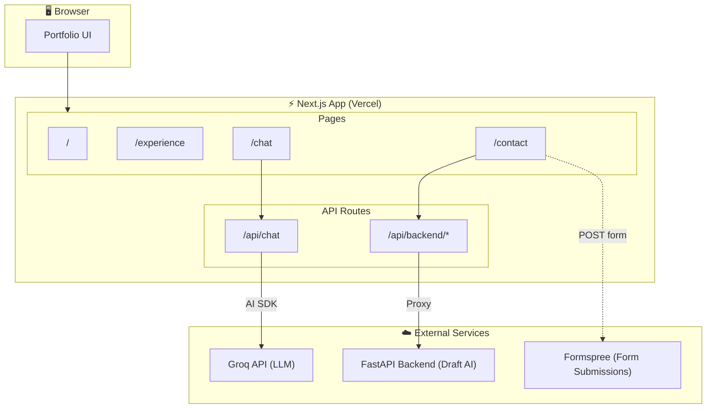

## José Mota — Portfolio

Minimal, black-and-white portfolio built with Next.js App Router and Tailwind CSS. It features a chat assistant powered by Groq via the AI SDK, an AI-enhanced contact form with draft generation and improvement capabilities, and an experience timeline.

## Architecture



### Tech stack

- **Framework**: Next.js 15 (App Router, TypeScript), React 19
- **Styling**: Tailwind CSS v4
- **UI Components**: shadcn/ui
- **Icons**: lucide-react, react-icons
- **AI & Backend**:
  - **Chat**: Vercel AI SDK (`ai`) + `@ai-sdk/groq` (server route at `/api/chat`)
  - **Contact Form AI**: FastAPI backend (separate service) proxied through `/api/backend`
- **Form Handling**: Formspree for form submission
- **Content**: react-markdown with remark-gfm for markdown rendering
- **Analytics**: `@vercel/analytics`

### Key features

- **Home**: Hero with minimalist aesthetic
- **Experience**: Work history with technologies and achievements
- **Chat**: Conversational assistant about José (`/chat` → `/api/chat`) powered by Groq
- **Contact Form**: AI-enhanced contact form with two powerful features:
  - **Create Draft**: Generate a professional draft message based on your name, email, and subject. Simply fill in the basic fields and click the sparkles icon to let AI craft your message.
  - **Improve Draft**: Refine your draft with specific instructions. Add feedback about tone, length, or details, and the AI will enhance your message accordingly.
- **Global navigation** and glass-style UI

## Getting started

### Installation

```bash
npm install
```

Notes:

- **Chat Assistant**: Uses Groq via `@ai-sdk/groq` with model `openai/gpt-oss-120b`. An active `GROQ_API_KEY` is required.
- **Contact Form Submission**: Posts to `https://formspree.io/f/<id>` using `NEXT_PUBLIC_FORMSPREE_FORM_ID`.
- **Contact Form AI Features**: The draft generation and improvement features require a FastAPI backend service. The Next.js app proxies requests to this backend via `/api/backend`. Ensure your FastAPI service is running and accessible at the `FASTAPI_URL` specified.

### Development

```bash
npm run dev
```

Runs the Next.js dev server with Turbo mode.

### Build & start

```bash
npm run build
npm start
```

### Lint & typecheck

```bash
npm run lint
npm run tsc
```

## Scripts

- **dev**: `next dev --turbo`
- **build**: `next build`
- **start**: `next start`
- **lint**: `eslint .`
- **tsc**: `tsc`
- **knip**: `knip`
